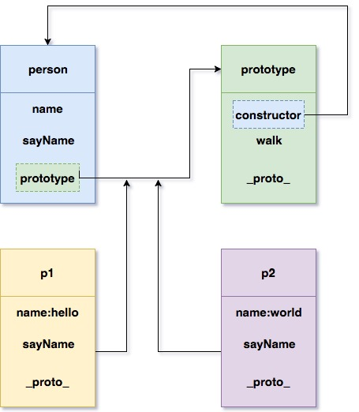

#### 问题1： OOP 指什么？有哪些特性

OOP（Object-Oriented-Programming），指面向对象程序设计。是一种程序设计思想。OOP把对象作为程序的基本单元，一个对象包含了数据和操作数据的函数。

三个基本特征分别为：

* 封装

也就是把客观事物封装成抽象的类，并且类可以把自己的数据和方法只让可信的类或者对象操作，对不可信的进行信息隐藏。封装是面向对象的特征之一，是对象和类概念的主要特性。 简单的说，一个类就是一个封装了数据以及操作这些数据的代码的逻辑实体。在一个对象内部，某些代码或某些数据可以是私有的，不能被外界访问。通过这种方式，对象对内部数据提供了不同级别的保护，以防止程序中无关的部分意外的改变或错误的使用了对象的私有部分。

* 继承

所谓继承是指可以让某个类型的对象获得另一个类型的对象的属性的方法。它支持按级分类的概念。继承是指这样一种能力：它可以使用现有类的所有功能，并在无需重新编写原来的类的情况下对这些功能进行扩展。 通过继承创建的新类称为“子类”或“派生类”，被继承的类称为“基类”、“父类”或“超类”。继承的过程，就是从一般到特殊的过程。要实现继承，可以通过“继承”（Inheritance）和“组合”（Composition）来实现。继承概念的实现方式有二类：实现继承与接口继承。实现继承是指直接使用基类的属性和方法而无需额外编码的能力；接口继承是指仅使用属性和方法的名称、但是子类必须提供实现的能力；

* 多态

就是指一个类实例的相同方法在不同情形有不同表现形式。多态机制使具有不同内部结构的对象可以共享相同的外部接口。这意味着，虽然针对不同对象的具体操作不同，但通过一个公共的类，它们（那些操作）可以通过相同的方式予以调用。

参考资料：[http://www.cnblogs.com/hnrainll/archive/2012/09/18/2690846.html](http://www.cnblogs.com/hnrainll/archive/2012/09/18/2690846.html)

#### 问题2： 如何通过构造函数的方式创建一个拥有属性和方法的对象?

```javascript
function Person(name, age) {
  this.name = name;
  this.age = age;
  this.sayHi = function() {
    console.log('Hello Wrold!');
  };
}

var person = new Person('face', 18);
```

#### 问题3： prototype 是什么？有什么特性

prototype是通过调用构造函数而创建的对象实例的原型对象。

将实例需要共享的属性和方法放在prototype对象中，实例对象将可以自动引用：

```javascript
function Person(name) {
  this.name = name;
}

Person.prototype = { species: 'people' };

var personOne = new Person('one');
console.log(personOne.species); //  people

var personTwo = new Person('two');
console.log(personTwo.species); //  people
```

在上面的例子中，species属性放到了prototype对象中，新建的实例都可以共享；
同时只要修改了prototype对象，实例对象也会随着修改。


#### 问题4：画出如下代码的原型图

```javascript
function People (name){
  this.name = name;
  this.sayName = function(){
    console.log('my name is:' + this.name);
  }
}

People.prototype.walk = function(){
  console.log(this.name + ' is walking');
}

var p1 = new People('hello');
var p2 = new People('world');
```



#### 问题5： 创建一个 Car 对象，拥有属性name、color、status；拥有方法run，stop，getStatus

```javascript
function Car(name, color, status) {
  this.name = name;
  this.color = color;
  this.status = status;
}

Car.prototype = {
  run: function() {
    console.log('It is running');
  },

  stop: function() {
    console.log('It is stop');
  },

  getStatus: function() {
    console.log(this.status);
  }
};

var car = new Car('audi', 'white', 'well');
```

#### 问题6： 创建一个 GoTop 对象，当 new 一个 GotTop 对象则会在页面上创建一个回到顶部的元素，点击页面滚动到顶部。拥有以下属性和方法

1. `ct`属性，GoTop 对应的 DOM 元素的容器
2.  `target`属性， GoTop 对应的 DOM 元素
3.  `bindEvent` 方法， 用于绑定事件
4. `createNode` 方法， 用于在容器内创建节点

```javascript
function GoTop() {
  this.ct = document.querySelector('.ct');
  this.target = this.createNode();
  this.bindEvent();
}

GoTop.prototype.bindEvent = function() {
  var self = this;
  this.target.onclick = function() {
    window.scrollTo(0, 0);
  };
};

GoTop.prototype.createNode = function() {
  var target = document.createElement('div');
  target.innerText = '点我回到顶部';
  target.classList.add('btn');
  this.ct.appendChild(target);
  return target;
};

var goTop = new GoTop();
```

#### 问题7： 使用木桶布局实现一个图片墙

查看源码：[点击查看](https://github.com/z2x/achieves/blob/master/barrellayout-oop.html)
效果预览：[点击查看](https://anddi.gitee.io/achieves/barrellayout-oop.html)


参考资料：[http://www.cnblogs.com/hnrainll/archive/2012/09/18/2690846.html](http://www.cnblogs.com/hnrainll/archive/2012/09/18/2690846.html)

参考资料：[http://www.ruanyifeng.com/blog/2011/06/designing_ideas_of_inheritance_mechanism_in_javascript.html](http://www.ruanyifeng.com/blog/2011/06/designing_ideas_of_inheritance_mechanism_in_javascript.html)

参考资料：[https://segmentfault.com/a/1190000000662547](https://segmentfault.com/a/1190000000662547)
