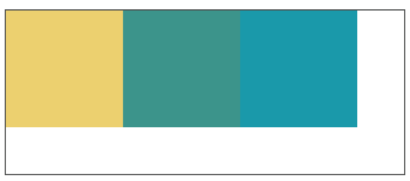
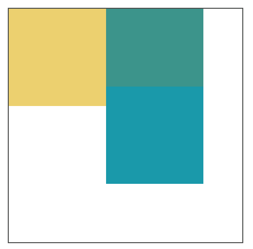
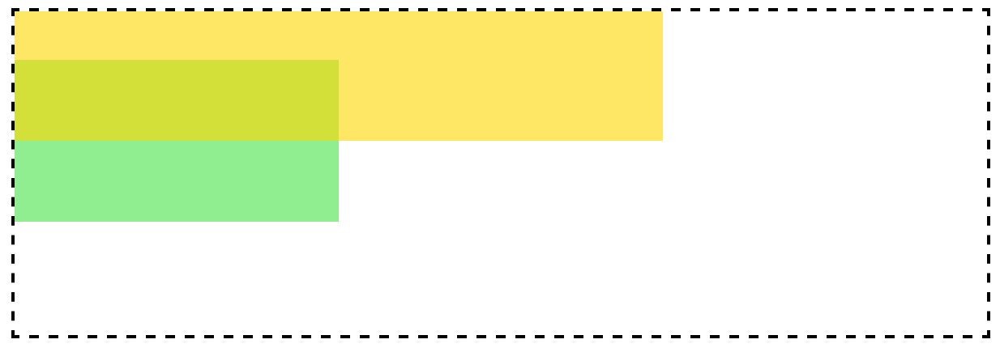
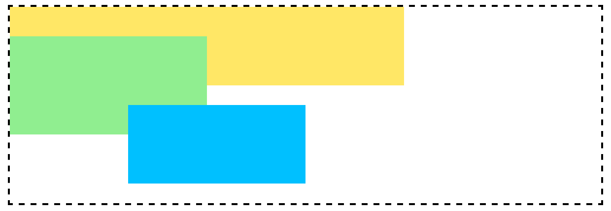

# 浮动元素有什么特征？对父容器、其他浮动元素、普通元素、文字分别有什么影响?

## CSS浮动的基本概念

浮动模型也是一种可视化格式模型，浮动的框可以左右移动（根据float属性值而定），直到它的外边缘碰到包含框或者另一个浮动元素的框的边缘。浮动元素不在文档的普通流中，文档的普通流中的元素表现的就像浮动元素不存在一样.

## 特征
1. 浮动定位将元素排除在普通流之外，即元素将脱离标准文档流；
2. 元素将不在页面占用空间。

## 对父容器的影响
浮动元素会向左或者向右平移，直到碰到容器边框或者另外一个浮动元素，会引起父容器高度塌陷。

```html
  <div style="border: solid 5px #0e0; width:300px;">
      <div style="height: 100px; width: 100px; background-color: Red;  float:left;">
      </div>
      <div style="height: 100px; width: 100px; background-color: Green;  float:left;">
      </div>
      <div style="height: 100px; width: 100px; background-color: Yellow;  float:left;">
      </div>
  </div>
```


## 对其他浮动元素的影响
如果父容器的宽度足够子元素的排列，那么会与其他浮动元素在同一方向上依次排列；

```html
    <div style="border: solid 1px #4C4E4D; width:340px;height: 140px;">
        <div style="height: 100px; width: 100px; background-color: #ECD06F;  float:left;">
        </div>
        <div style="height: 100px; width: 100px; background-color: #3C948B;  float:left;">
        </div>
        <div style="height: 100px; width: 100px; background-color: #1A99AA;  float:left;">
        </div>
    </div>
```



如果父容器的宽度不够子元素的排列，超出的元素会向下移动，并寻找足够的空间；此时加入元素高度不统一，元素向下移动时会被卡住。

```html
    <div style="border: solid 1px #4C4E4D; width:240px;height: 240px;">
        <div style="height: 100px; width: 100px; background-color: #ECD06F;  float:left;">
        </div>
        <div style="height: 80px; width: 100px; background-color: #3C948B;  float:left;">
        </div>
        <div style="height: 100px; width: 100px; background-color: #1A99AA;  float:left;">
        </div>
    </div>
```



## 对普通元素的影响
浮动元素之前的普通元素不受影响。浮动元素之后的普通元素因感知不到浮动元素的存在会被浮动元素覆盖。

## 对文字的影响
浮动元素旁边的行框被缩短,从而给浮动元素流出空间,因而行框围绕浮动框。

```html
    <div style="border: solid 1px #4C4E4D; width:240px;height: 240px;">
        <div style="height: 100px; width: 100px; background-color: #ECD06F;  float:left;">
        </div>
        <p>Lorem ipsum dolor sit amet, consectetur adipisicing elit, sed do eiusmod tempor incididunt ut labore et dolore magna aliqua. Ut enim ad minim veniam.</p>
    </div>
```


#  清除浮动指什么? 如何清除浮动? 两种以上方法

没有预先给父元素设置高度，子元素浮动引起父元素高度塌陷。
浮动使得元素脱离文档流，所以子元素不能撑开父元素的高度。此时的div中，相当于div中子元素高度为0，所以发生了父元素高度塌陷现象。
清除浮动指：消除浮动引起的父元素高度塌陷问题。

## 清理浮动的方法

1. 父级div定义height属性；

2. 添加新的元素，应用 clear：both;`

```html
    <div style="border: solid 1px #4C4E4D; width:340px;">
        <div style="height: 100px; width: 100px; background-color: #ECD06F;  float:left;">
        </div>
        <div style="height: 100px; width: 100px; background-color: #3C948B;  float:left;">
        </div>
        <div style="height: 100px; width: 100px; background-color: #1A99AA;  float:left;">
        </div>
        <div style="clear:both;">
        </div>
    </div>
```

3. 父级div定义伪类:after和zoom

```html
<head>
    <style>
    #clearfix {
        *zoom: 1;
    }

    #clearfix:after {
        content: "";
        display: table;
        clear: both;
    }
    </style>
</head>

<body>
    <div id="clearfix" style="border: solid 1px #4C4E4D; width:340px;">
        <div style="height: 100px; width: 100px; background-color: #ECD06F;  float:left;">
        </div>
        <div style="height: 100px; width: 100px; background-color: #3C948B;  float:left;">
        </div>
        <div style="height: 100px; width: 100px; background-color: #1A99AA;  float:left;">
        </div>
    </div>
```

4. BFC清理浮动

5. 通用的清理浮动方法

```css
 /*方法1*/
  .clearfix{
      *zoom:1;
  }
  .clearfix:after{
      content:"";
      display:block;
      clear:left;
  }


  /*方法2*/
  .clearfix{
    *zoom:1;
  }
  .clearfix:after{
    content:"";
      display:table;
      clear:both;
  }
```

# 有几种定位方式，分别是如何实现定位的，参考点是什么，使用场景是什么？
| 定位方式 | 实现原理                                               | 参考点                                                     | 使用场景                         |
| -------- | ------------------------------------------------------ | ---------------------------------------------------------- | -------------------------------- |
| static   | 顺序文档流                                             | 父元素                                                     | （默认值） 顺序文档生成          |
| relative | 元素保留所占空间，相对于普通位置定位                   | 原来位置                                                   | 绝对定位的参考点或者内容的小偏移 |
| absolute | 元素框从文档流完全删除，然后进行定位                   | body块或者相对于position值不为static的第一位祖先元素来定位 | 居中或绝对位置                   |
| fixed    | 固定在浏览器的窗口中，不会随着窗口的滚动和产生位置变化 | 浏览器窗口                                                 | 固定边栏或底栏                   |


# z-index 有什么作用? 如何使用?

z-index 属性指定了一个元素及其子元素的 z-order。 当元素之间重叠的时候，z-order 决定哪一个元素覆盖在其余元素的上方显示。 通常来说 z-index 较大的元素会覆盖较小的一个。

对于一个已经定位的元素（即position属性值是非static的元素），z-index 属性指定：
* 层叠顺序
* 层叠上下文
* 层叠水平

z-index属性一共可以取3个值：
1. auto：（默认值），当前元素的层叠级数为0，不会创建层叠上下文；
2. `<integer>`：整型数字，可以为正负值，指示层叠级数，创建新的层叠上下文；
3. inherit：继承父元素属性值。

**注意：z-index只在定位元素中起作用**

```html
    <style>
      .container{
        position: relative;
        z-index: 1;
        border: 2px dashed black;
        width: 600px;
        height: 200px;
        margin: 0 auto;
      }
      .top{
        position: absolute;
        background-color: gold;
        width: 80%;
        height:40%;
        margin: 2em;
        z-index: 4;
        opacity: 0.6;
      }
      .bottom{
        position: absolute;
        background-color: lightgreen;
        width: 40%;
        height: 40%;
        margin: 5em;
        z-index: 3;
      }
  </style>
  </head>
  <body>
    <div class="container">
      <div class="top"></div>
      <div class="bottom"></div>
    </div>
  </body>
```

显示效果为：


在这个示例中，top盒子设置为`z-index:4;`而bottom盒子设置为`z-index:3;`根据上图可以得知，top盒子的层叠顺序高于bottom的层叠顺序,所以top盒子显示在上层。

层叠顺序

每个元素都有层叠顺序，当元素发生层叠时，元素的层级高的会优先显示在上面，层级一样的则会根据dom的先后顺序进行渲染，后面的会覆盖前面的。


根据上图不使用`z-index`改变层叠顺序：

```html
 <style>
    .container {
      border: 2px dashed black;
      width: 600px;
      height: 200px;
      margin: 0 auto;
    }

    .top {
      background-color: gold;
      width: 400px;
      height: 80px;
      opacity: 0.6;
    }

    .bottom {
      background-color: lightgreen;
      width: 200px;
      height: 100px;
      margin-top: -50px;
    }
  </style>
</head>

<body>
  <div class="container">
    <div class="top"></div>
    <div class="bottom"></div>
  </div>
</body>
```
显示效果为：

在这个示例中，top盒子设置为inline-block；而bottom盒子仍然为block，根据上图可以得知，top盒子的层叠顺序高于bottom的层叠顺序,所以top盒子显示在上层。

z-index的层叠顺序并不是值越大，显示越靠前，前提是要在同一级div中。

```html
 <style>
    .container {
      border: 2px dashed black;
      width: 600px;
      height: 200px;
      margin: 0 auto;
    }

    .top {
      background-color: gold;
      width: 400px;
      height: 80px;
      opacity: 0.6;
    }

    .bottom {
      position: absolute;
      background-color: lightgreen;
      width: 200px;
      height: 100px;
      margin-top: -50px;
      z-index: 3;
    }
    .bottom>div{
      position: absolute;
      background-color: #00C0FF;
      width: 180px;
      height: 80px;
      margin-top: 70px;
      margin-left: 120px;
      z-index: 9999;
    }
  </style>
</head>

<body>
  <div class="container">
    <div class="top"></div>
    <div class="bottom">
      <div></div>
    </div>
  </div>
</body>
```
显示效果为：

参考资料：
[http://web.jobbole.com/86008/](http://web.jobbole.com/86008/)
[https://webdesign.tutsplus.com/zh-hans/articles/what-you-may-not-know-about-the-z-index-property--webdesign-16892](https://webdesign.tutsplus.com/zh-hans/articles/what-you-may-not-know-about-the-z-index-property--webdesign-16892)

# position:relative和负margin都可以使元素位置发生偏移?二者有什么区别

`position:relative`：元素位置发生变化，但在文档流中的位置不变，不会影响后面元素在文档流中的显示；

负margin会引起元素的显示位置和文档流的改变，且会影响后面元素在文档流中的显示。

# BFC 是什么？如何生成 BFC？BFC 有什么作用？举例说明

块级格式化上下文，在内部形成一个独立的渲染区域，并根据内部规则进行布局，和外部元素相互独立。

## BFC 特性

### BFC会阻止垂直外边距（margin-top、margin-bottom）折叠

* 按照BFC的定义，只有同属于一个BFC时，两个元素才有可能发生垂直Margin的重叠，这个包括相邻元素，嵌套元素，只要他们之间没有阻挡(例如边框，非空内容，padding等)就会发生margin重叠。
* 因此要解决margin重叠问题，只要让它们不在同一个BFC就行了，但是对于两个相邻元素来说，意义不大，没有必要给它们加个外壳，但是对于嵌套元素来说就很有必要了，只要把父元素设为BFC就可以了。这样子元素的margin就不会和父元素的margin发生重叠

### BFC不会重叠浮动元素

## 如何形成BFC

* `float:left|right`
* `overflow:hidden|auto|scroll`
* `display:table-cell|table-caption|inline-block`
* `position:absolute|fixed`

## 局限性

使用BFC使用float的时候会使父容器长度缩短，而且还有个重要缺陷——父容器float解决了其塌陷问题，那么父容器的父容器怎么办？overflow属性会影响滚动条和绝对定位的元素；position会改变元素的定位方式，这是我们不希望的，display这几种方式依然没有解决低版本IE问题。

## hasLayout

IE6、7内有个hasLayout的概念，当元素的hasLayout属性值为true的时候会达到和BFC类似的效果，元素负责本身及其子元素的尺寸设置和定位。 下面使元素hasLayout为true

* `position: absolute`
* `float: left|right`
* `display: inline-block`
* `width`: 除 “auto” 外的任意值
* `height`: 除 “auto” 外的任意值
* `zoom`: 除 “normal” 外的任意值
* `writing-mode: tb-rl`
* 在IE7中使用`overflow: hidden|scroll|auto` 也可以使`hasLayout:true;`

# 在什么场景下会出现外边距合并？如何合并？如何不让相邻元素外边距合并？给个父子外边距合并的范例

块的顶部外边距和底部外边距有时被组合(折叠)为单个外边距，其大小是组合到其中的最大外边距，这种行为称为外边距塌陷(margin collapsing)，有的地方翻译为外边距合并。

1. 相邻的兄弟姐妹元素

毗邻的两个兄弟元素之间的外边距会塌陷（除非后者兄弟姐妹需要清除过去的浮动）。


2. 块级父元素与其第一个/最后一个子元素

如果块级父元素中，不存在上边框、上内边距、内联元素、 清除浮动 这四条属性（也可以说，当上边框宽度及上内边距距离为0时），那么这个块级元素和其第一个子元素的上边距就可以说”挨到了一起“。此时这个块级父元素和其第一个子元素就会发生上外边距合并现象，换句话说，此时这个父元素对外展现出来的外边距将直接变成这个父元素和其第一个子元素的margin-top的较大者。

类似的，若块级父元素的 margin-bottom 与它的最后一个子元素的margin-bottom 之间没有父元素的 border、padding、inline content、height、min-height、 max-height 分隔时，就会发生下外边距合并现象。


* 父元素的上边距会与第一个子元素的上边距合并；
* 最后一个子元素的下边距会与父元素的下边距合并。

 ​案例：

```html
<div style="background: #ECD06F;margin: 20px;overflow: hidden;">
     <div style="background: #3C948B;margin: 40px;">
        Lorem ipsum dolor sit amet, consectetur adipisicing elit, sed do eiusmo.
     </div>
 </div>
```


3. 空块元素

如果存在一个空的块级元素，其 border、padding、inline content、height、min-height 都不存在。那么此时它的上下边距中间将没有任何阻隔，此时它的上下外边距将会合并。


4. 以上3种情况的混合：

   

参考信息：
[https://developer.mozilla.org/zh-CN/docs/Web/CSS/CSS_Box_Model/Mastering_margin_collapsing](https://developer.mozilla.org/zh-CN/docs/Web/CSS/CSS_Box_Model/Mastering_margin_collapsing)
[http://geekplux.com/2014/03/14/collapsing_margins.html](http://geekplux.com/2014/03/14/collapsing_margins.html)


外边距合并的规则：

- 两个margin都是正值的时候，取两者的**最大值**；
- 当 margin 都是负值的时候，取的是其中**绝对值较大**的，然后，从0位置，负向位移；
- 当有正有负的时候，先取出**负 margin 中绝对值中最大的**，然后，和**正 margin 值中最大的 margin 相加**。
- 所有毗邻的margin要一起参与运算，不能分步进行。

消除边界合并的方法：

* 被非空内容、padding、border 或 clear 分隔开。
* 不在一个普通流中或一个BFC中。
* margin在垂直方向上不毗邻。

练习作品1：[查看链接](https://anddi.gitee.io/blog/2018-02/code/alert.html)
练习作品2：[查看链接](https://anddi.gitee.io/blog/2018-02/code/input-form.html)
练习作品3：[查看链接](https://anddi.gitee.io/blog/2018-02/code/modal.html)
练习作品4：[查看链接](https://anddi.gitee.io/blog/2018-02/code/navigation.html)
