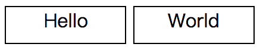
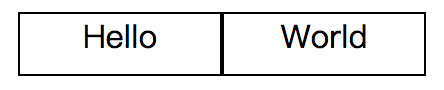
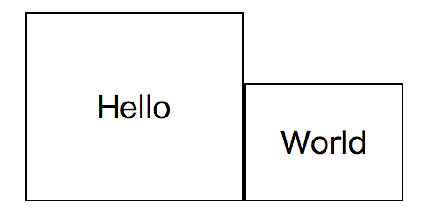

[TOC]

<div id="top">

在页面布局的过程中，我们经常会使用`display: inline-block`方法对目标内容的显示进行设置，在使用过程中发现以下几个特点：

* 呈现inline特性（不占据一整行，宽度由内容宽度决定）
* 呈现block特性（可以设置宽高和内外边距）
* 内容间隙问题
* 不同高度的对齐问题

初始HTML代码：
```html
  <main>
    <span>Hello</span>
    <span>World</span>
  </main>
```

<div id="html">

我们可以直接添加以下CSS内容来演示inline特性和block特性：
```css
span {
  display: inline-block;
  width: 100px;
  height: 30px;

  border: 1px solid;
}
```

此时呈现出来的效果为：



[⬆返回顶部](#top)

## 内容间隙问题

在上面的图中，可以很明显的看到两个span内容之间有一条缝隙，其实这是因为在换行显示或者空格分隔的情况下，就是显示出来一条缝隙。

找到原因以后，我们就可以很方便的找到解决方法：
既然是有换行或者空格，那么直接删除不就好了。

这时候开始修改HTML代码：

  <main>
    <span>Hello</span><span>World</span>
  </main>

此时呈现出来的效果为：



这时候我们就可以看到效果，两个内容之间的缝隙已经被去除了。

可是这时候又暴露出另一个问题，如果内容太多，连成一行就会影响代码的可读性，那么接下来我们看一下新的处理方法。

**解决方法：`font-size: 0`**

**在父元素上将字体大小设置为0，在分别设置子元素的字体大小。**

这是我们仍然使用初始HTML代码内容。

修改后的CSS代码内容是这样的：
```css
main {
  font-size: 0;
}
span {
  display: inline-block;

  width: 100px;
  height: 30px;

  font-size: 18px;

  border: 1px solid;
}
```

[⬆返回顶部](#top)

## 不同高度的对齐问题

在目标内容高度不一致的情况下，互相对齐显得不是那么近和人意，因为使用
`display: inline-block`后，内容变为行内块级元素，具有了行内元素的特性，内容将基于文字基线对齐，下面我们来验证一下。

仍然使用初始化HTML代码内容，可以[点击查看内容](#html)。

```css
main {
  text-align: center;
  font-size: 0;
}
span {
  display: inline-block;

  font-size: 18px;

  border: 1px solid;
}

main :first-child {
  padding: 40px;
}

main :last-child {
  padding: 20px;
}
```

这时候会这样显示（添加了参考线）：


如果需要进行对齐，那么可以在父元素上面直接使用`vertical-align`进行设置，比如给`span`标签样式添加`vertical-align: bottom;`那么将显示为：



[⬆返回顶部](#top)
