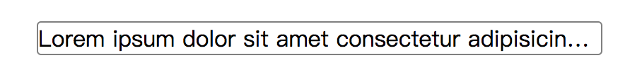
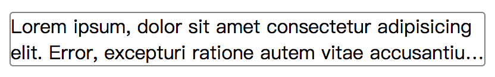

在内容概览界面通常会出现文本溢出，为了内容的展示和美观，我们需要对文本进行处理，一般还可以分为单行文本溢出和多行文本溢出。下面我们来看一下这两种情况的解决方法。

# 单行文本溢出

## 解决思路：

1. 设置文本不换行；
2. 隐藏多出来的文字；
3. 设置多余文字的显示方式。

## 实现方法：

```css
white-space: nowrap;
overflow: hidden;
text-overflow: ellipsis;
```

显示效果：



# 多行文本溢出

## 解决思路：

* display: -webkit-box; 必须结合的属性 ，将对象作为弹性伸缩盒子模型显示 。
* -webkit-line-clamp用来限制在一个块元素显示的文本的行数。 为了实现该效果，它需要组合其他的WebKit属性。常见结合属性：
* -webkit-box-orient 必须结合的属性 ，设置或检索伸缩盒对象的子元素的排列方式 。
* 隐藏超出范围的文本内容。

## 实现方法：

```css
display: -webkit-box;
-webkit-line-clamp: 2;
-webkit-box-orient: vertical;
overflow: hidden;
```

显示效果：



效果预览地址：[https://anddi.gitee.io/blog/2018-06/code/text-overflow.html](https://anddi.gitee.io/blog/2018-06/code/text-overflow.html)

代码预览地址：[https://gitee.com/zhued/blog/tree/master/2018-06/code/text-overflow.html](https://gitee.com/zhued/blog/tree/master/2018-06/code/text-overflow.html)
