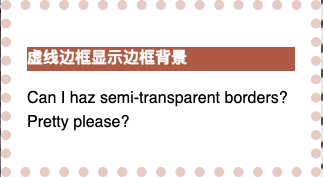
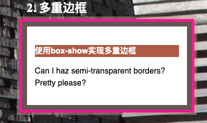

# 透明边框和多重边框

## 透明边框

当看到透明边框时，可能很多人首先想到的是直接使用rgba或者hsla就可以直接实现了，那我们来实际实验一下，实践代码可以从文章最后的链接看到，结果显示我们是无法使用这两种方式实现透明边框的。

尽管看起来达不到我们想要的效果，但其实边框是实际存在的，在默认情况下，背景会直接延伸到边框所在区域的下层，我们可以使用虚线边框来直接验证一下，



到这里就可以把问题定位到背景，通过查询w3c文档，我们找到这样一个属性，`backfround-clip`，通过对他的值进行修改，我们就可以控制background的绘制区域了，想到了解更多，可以点击进行更多了解:

[background-clip](https://www.w3.org/TR/css-backgrounds-3/#the-background-clip)

background-clip属性的初始值是border-box，也就是背景色会被元素的border box（边框的外延框）裁切掉，如果我们想要背景跑到边框所在范围，那么我们就把值设置为padding-box，这样浏览器就会用内边距的外延来把背景裁切掉：

```css
border: 10px solid rgba(205, 151, 140, 50%); 
background-clip: padding-box;
```

## 多重边框

在css中，我们可以直接使用`box-show`来生成投影，其实这个属性还支持逗号分割语法，以此来生成任意数量的投影。

```css
{
box-shadow: 0 0 0 10px #655,
            0 0 0 15px deeppink,
            0 0 0 20px rgba(205, 151, 140, 50%);
}
```


